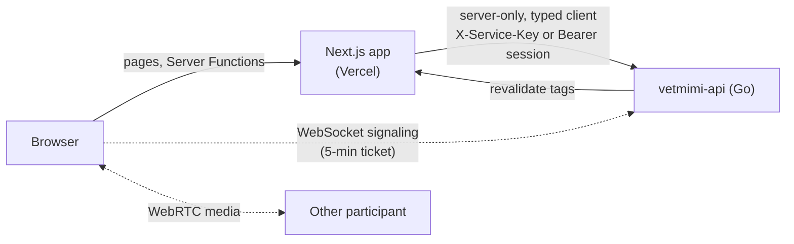

<div align="center">

# VetMiMi — Website & Admin

**The bilingual website, booking flow, admin console and video session pages for VetMiMi, an art therapy practice in Sydney.**

[Live site](https://vetmimi-arts-therapy.vercel.app) · [Go API](https://github.com/VetMiMi/vetmimi-api) · [Project status](docs/project-status.md)

[](https://github.com/VetMiMi/vetmimi-next/actions/workflows/ci.yml)


</div>

---

## About

VetMiMi is Daw Mi's art therapy practice in Sydney. This Next.js App Router app is everything people see:

- the public site in **English and Burmese**
- online booking, and a private link where clients manage their appointment
- an **admin console** where Daw Mi runs bookings, availability, enquiries and posts
- **in-browser video sessions** between Daw Mi and a client

All data, auth, booking rules and video signaling live in the Go API, [VetMiMi/vetmimi-api](https://github.com/VetMiMi/vetmimi-api). This app talks to the API **only from the server**, so no API key or session token ever reaches the browser.

## Features

**Visitors and clients**

- Home, About, Services (3 service pages), Art of Wellness, Portfolio gallery, Stories, Contact, and the legal pages. Every page has an English version and a Burmese version under `/my`.
- **Booking** in four steps: service → date and time (practice time zone) → details → review. If a slot is taken in the meantime, the API offers alternative times.
- **Manage link** (`/manage/<token>`): cancel the appointment, with a late-cancellation warning, or ask to reschedule by proposing up to 3 times. The current booking stays in place until a new time is confirmed.
- **Video session** (`/session/<token>`): a camera and mic check with a level meter, then a 1:1 call. The session page handles opening the link too early, a weak connection, reconnecting, and being replaced when the same person joins from another device.

**Admin console (`/admin`, English only)**

- Sign-in with email, password and a **TOTP code**. The console has three roles (site admin, booking admin, content editor), and the navigation shows each person only what their role allows.
- **Appointments:** a list with filters and an "attention" panel. Each appointment's page shows its history and private notes, and offers only the status changes the API allows for it. Daw Mi can reschedule, create appointments manually, and start the video session from here.
- **Availability:** weekly hours, date overrides, and blocks. When a new block clashes with existing bookings, the console warns before saving.
- **Services** (create, edit, pause, resume) and **Enquiries** (inbox, mark handled).
- **Posts:** one editor writes for the website and for Facebook, Instagram and LinkedIn, with:
  - a preview for each channel
  - a media library with alt text
  - readiness checks before publishing
  - an approval workflow
  - a calendar view
  - AI-suggested versions of a post
- **Settings:** booking rules, an on/off switch for public booking, and connections to Meta and LinkedIn through OAuth.

## How it's built

- **The server is the browser's only contact with the API.** All API calls go through `lib/api/client.ts`, which is marked `server-only`. It is typed from the API's OpenAPI contract, and every call has a 10-second timeout. Error details from the API are removed before anything reaches a page. Visitors' IP addresses are forwarded so the API can rate-limit.
- **The API types always match a released version of the API.** `pnpm api:types` regenerates `lib/api/schema.ts` from `openapi.yaml` at the API version pinned in `package.json` (`v0.4.2`). CI regenerates the file and fails if it differs from the committed copy.
- **Video calls are 1:1 WebRTC** (`lib/session/`):
  - The browser gets a 5-minute ticket from the server, then opens a WebSocket to the API for signaling.
  - Peers connect using the standard WebRTC "perfect negotiation" pattern.
  - Dropped connections reconnect with backoff (1→30 s with jitter, giving up after 90 s) and restart ICE after a 4-second grace period.
  - When round-trip time goes above 400 ms or packet loss above 5%, video is capped at 300 kbps until the connection recovers.
  - The call's state is held in a pure reducer, which is unit-tested.
- **Times are always in the practice's time zone.** Calendar maths runs in Australia/Sydney time using the browser's `Intl` APIs, so a visitor in another time zone never sees a booking land on the wrong day.
- **Spam is blocked without third-party services.** Forms use a hidden honeypot field and an HMAC-signed timestamp that rejects any submit made less than 3 s after the form loaded. Idempotency keys make retries and double-clicks safe.
- **Both languages are checked in CI.** A script checks that English and Burmese have the same message keys and that every page has a title and a 50–160-character description. Burmese text uses dedicated font fallbacks.
- **Search and sharing:** hreflang tags, a sitemap, schema.org JSON-LD, and a generated social preview image for each page. When an article is published, the API tells the site to refresh the affected pages through a secret-protected webhook.

## Tech stack

| Layer      | Technology                                                                                                           |
| ---------- | -------------------------------------------------------------------------------------------------------------------- |
| Framework  | Next.js 16 (App Router, Server Functions, `proxy.ts`), React 19, TypeScript 5                                        |
| Styling    | Tailwind CSS 4, CSS variable design tokens, Phosphor icons, `next/font` (Fraunces, Manrope, Noto Sans/Serif Myanmar) |
| i18n       | next-intl 4: English at `/`, Burmese at `/my`, 12 message namespaces                                                 |
| API client | openapi-fetch + openapi-typescript, generated from the API's OpenAPI contract                                        |
| Real-time  | WebRTC (`RTCPeerConnection`), WebSocket signaling                                                                    |
| Content    | react-markdown                                                                                                       |
| Testing    | `node:test` unit tests, Playwright, axe-core                                                                         |
| Hosting    | Vercel (production from `main`, a preview deploy for every PR)                                                       |

## Architecture



- The middleware (`proxy.ts`) sends `/admin` past next-intl and redirects to sign-in when there's no session cookie. The cookie is only a first check: the API verifies the session on every admin call.
- `app/[locale]/` holds the public site, `app/admin/` holds the console, and `app/api/` holds four small route handlers: availability, session tickets, revalidation and media upload.
- Admin sessions use an httpOnly cookie scoped to `/admin`. Admin pages can't be shown in a frame, and the manage and session pages are never indexed or cached and send no referrer.

## Getting started

**Prerequisites:** Node.js 22+, pnpm 10 (via Corepack). For booking, admin and video, you also need [vetmimi-api](https://github.com/VetMiMi/vetmimi-api) running locally (`make dev`, port 8080).

```sh
pnpm install
cp .env.example .env.local   # then fill in the values below
pnpm dev                     # http://localhost:3000
```

| Variable                 | Purpose                                                                                                                                                                                                                  |
| ------------------------ | ------------------------------------------------------------------------------------------------------------------------------------------------------------------------------------------------------------------------ |
| `API_URL`                | Base URL of the Go API: `http://localhost:8080` locally; in production, the API host's own address (the hostname behind the API's `PUBLIC_API_URL`)                                                                      |
| `API_SERVICE_KEY`        | The API's `SERVICE_KEY`, sent as `X-Service-Key` on public routes and sign-in                                                                                                                                            |
| `SITE_REVALIDATE_SECRET` | Shared secret the API sends to `POST /api/revalidate` when an article is published                                                                                                                                       |
| `SITE_URL`               | _Optional._ Public address used for canonical links, hreflang, the sitemap and social cards. Without it, Vercel production builds use the project's production domain and every other build uses `http://localhost:3000` |

All variables are server-only (there is no `NEXT_PUBLIC_`). Preview values live in Vercel; the live values live on the host and in the release workflow (see [Self-hosting](#self-hosting)). **A build needs none of them.** Without the API, the site still runs: booking shows "not available yet", stories fall back to the built-in content, and admin sign-in explains that it isn't available. Only the live site (Vercel production, or a build with `SITE_ENV=production`) allows search engines to crawl (`app/robots.ts`); every other build sends `Disallow: /`.

**Useful scripts**

| Command           | What it does                                                                                                     |
| ----------------- | ---------------------------------------------------------------------------------------------------------------- |
| `pnpm gate`       | Runs lint, format check, type check, i18n check, unit tests and production build, one machine-wide run at a time |
| `pnpm test:unit`  | Unit tests in `lib/**/*.test.ts` (Node's built-in test runner)                                                   |
| `pnpm i18n:check` | Checks English/Burmese key parity and page metadata                                                              |
| `pnpm api:types`  | Regenerates `lib/api/schema.ts` from the pinned API version                                                      |
| `pnpm e2e`        | Playwright and axe, run against a site that is already running                                                   |

## Testing

- **Unit tests:** 171 tests in 29 files cover the logic that has no UI: time zones, spam checks, SEO and the sitemap, the session state machine and reconnects, connection-quality stats, admin workflows, and open-redirect protection.
- **End-to-end:** Playwright with axe checks every public page, in English and Burmese, on desktop (1280 px) and mobile (375 px):
  - WCAG 2.2 AA violations
  - no sideways scrolling at 320 px
  - keyboard use of the skip link, menu and language switcher

  These checks run in CI. Known failures are listed in `e2e/axe-baseline.json`. The baseline only ratchets down: a new failure fails the job, and so does a listed failure that has been fixed until its entry is removed. When the job fails, download the `playwright-report` artifact from the run's summary page and open `index.html` (or run `pnpm exec playwright show-report <folder>`). Each axe test includes an `axe-violations.json` attachment naming the rule, its impact and the elements involved.

- **CI** (`.github/workflows/ci.yml`) runs on every PR and every push to `main`, with four jobs:
  - **Web checks:** the API types match the pinned version, then lint, format, types, i18n, unit tests and build
  - **Web end-to-end:** the Playwright and axe checks above
  - **Dockerfile lint:** hadolint on the `Dockerfile`
  - **Commit checks:** every commit message follows the Conventional Commits format
- **Image check** (`.github/workflows/image.yml`) builds the Docker image on PRs that change it or its dependencies, starts it, and checks `/api/health` and image resizing.

## Self-hosting

The live site runs on the same AWS host as the API, as a Docker container behind Caddy. Vercel only builds pull request previews.

- **Image:** `ghcr.io/vetmimi/vetmimi-next:<commit sha>` (and `:main` for the latest), `linux/arm64`, built from the `Dockerfile`: Next's standalone server on Node 22 Alpine, run as the `node` user on port 3000.
- **Health:** `GET /api/health` answers `200 {"status":"ok"}` without calling the API. The image's Docker health check uses it, and so does the host's deploy.
- **Deploys:** after CI passes on `main`, `.github/workflows/release.yml` builds the image on an Arm runner, pushes both tags, then runs `ssh deploy@$DEPLOY_HOST web <sha>`. The deploy key may run only the host's `deploy.sh`, which pulls the image, swaps it in, and rolls back if it isn't healthy. Without `DEPLOY_HOST` the deploy is skipped. To redeploy `main`, run the workflow by hand.

Static pages are rendered while the image is built, so their address is fixed then:

| Build input                                | Where it is set                                  | Purpose                                                                                                                                                                  |
| ------------------------------------------ | ------------------------------------------------ | ------------------------------------------------------------------------------------------------------------------------------------------------------------------------ |
| `SITE_URL` build argument                  | Repository variable `SITE_URL`                   | Public address for canonical links, hreflang, the sitemap and social cards. Required to deploy                                                                           |
| `SITE_ENV=production` build argument       | `release.yml`                                    | Marks the live site: `robots.txt` allows crawling and IndexNow is pinged                                                                                                 |
| `api_url`, `api_service_key` build secrets | Secrets `BUILD_API_URL`, `BUILD_API_SERVICE_KEY` | _Optional._ The API's public address and key, so the home and stories pages are built with the published articles. Mounted for the build only, never stored in the image |

Both build arguments are also the image's defaults at run time. The host supplies the server secrets as environment variables: `API_URL` (the API on the host's internal network), `API_SERVICE_KEY`, `SITE_REVALIDATE_SECRET` and, optionally, `INDEXNOW_KEY`. `NODE_OPTIONS` defaults to `--max-old-space-size=320`; override it there if needed. The deploy job needs the `production` environment's `DEPLOY_HOST`, `DEPLOY_SSH_KEY` and `DEPLOY_KNOWN_HOSTS` secrets.

## Project status

The public site, booking, manage links, the admin console (appointments, availability, services, enquiries, posts, settings) and video sessions are built and live. Before launch, the remaining work is:

- end-to-end tests for flows that use the API
- the accessibility issues still in the baseline
- a review of the Burmese text by a native speaker
- the legal pages
- an admin dashboard and CSV export

See [open issues](https://github.com/VetMiMi/vetmimi-next/issues) and [`docs/project-status.md`](docs/project-status.md).

## Documentation

- [`AGENTS.md`](AGENTS.md): working agreement, layout and contribution rules
- [`docs/`](docs/): project status and the admin design brief
- [`messages/README.md`](messages/README.md): how the site's text and the Burmese translations work
- API design decisions: [vetmimi-api/docs/adr](https://github.com/VetMiMi/vetmimi-api/tree/main/docs/adr)
